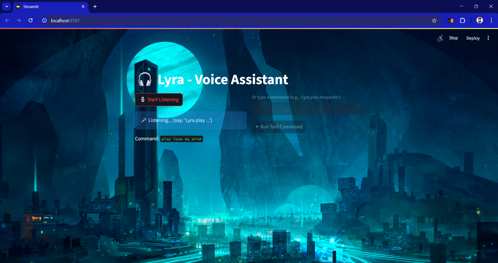
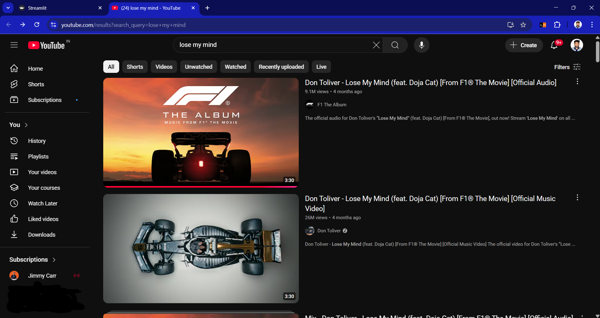

# Lyra-YT-Voice-Assistant

🎧 Voice-controlled YouTube assistant built with Python and Streamlit. Ask Lyra to play any song or type commands directly. Female voice responses, witty remarks, and instant YouTube search in your browser.  

> Run Lyra and tell her what to play, or type your command.

---

### 🔧 What it does
- Listens to voice commands using your microphone (`Lyra play <song>`).  
- Plays requested songs by opening YouTube search results in the default browser.  
- Provides witty, playful responses for feedback and errors.  
- Supports text input commands for typing instead of speaking.  
- Displays a custom background image in the Streamlit interface.  
- Uses a female voice for all speech responses.

---

### 🖼️ Demo

**Demo1 – Voice Command**  
  
*Lyra listening and responding to a voice command.*

**Demo2 – Text Command**  
  
*Lyra receiving a typed command and opening YouTube.*

